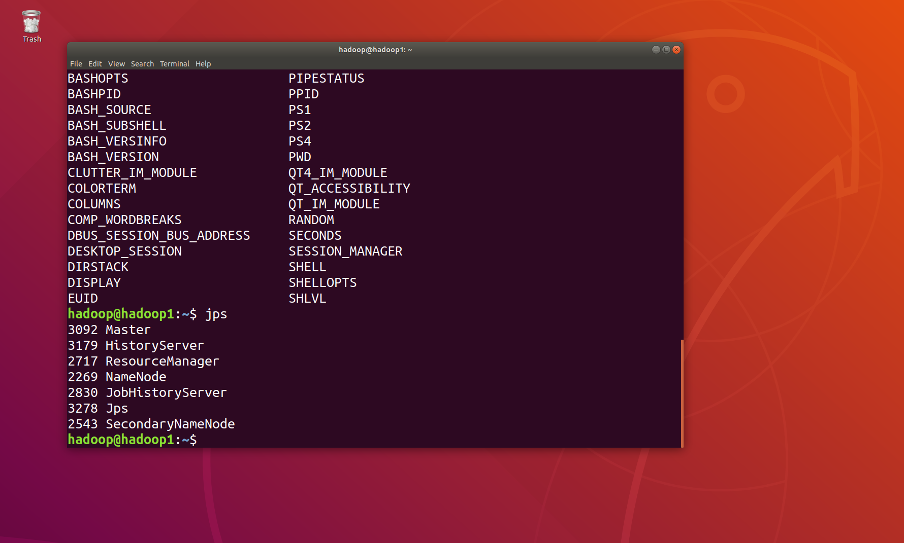
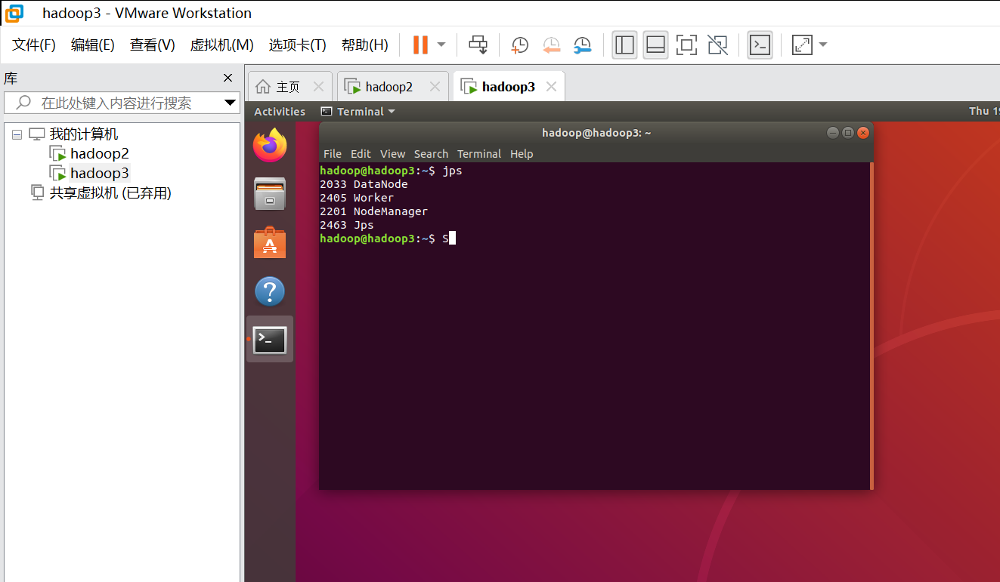
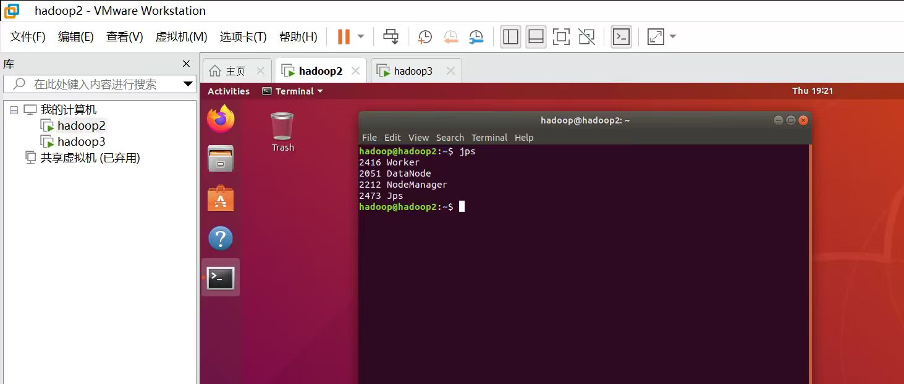
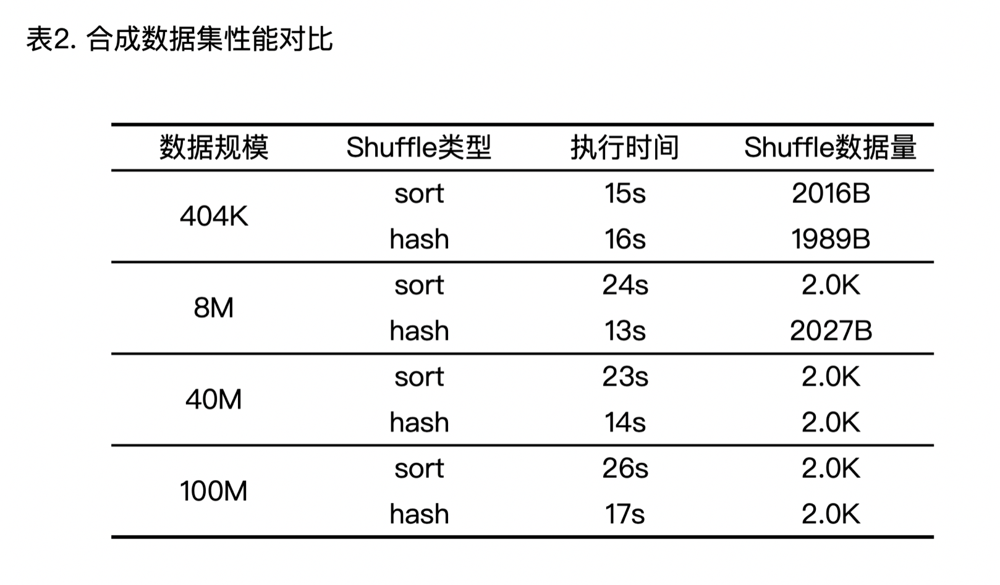
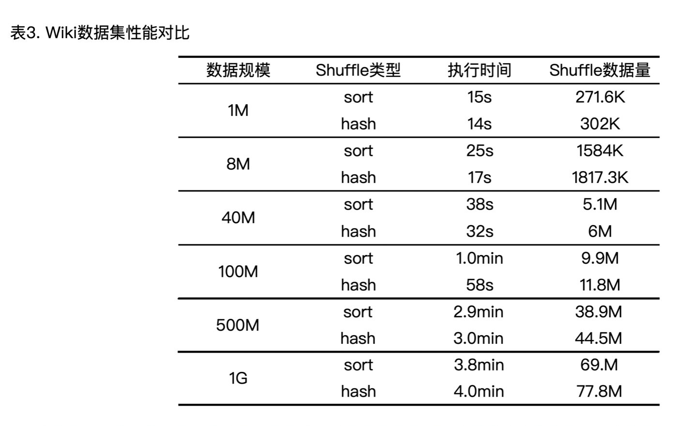
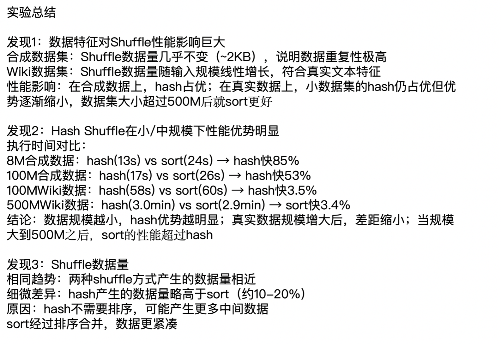

# 实验记录

## 研究目的

比较Spark中的两种Shuffle算法：基于Hash和基于Sort

## 研究内容

对比分析Spark中基于Hash和基于Sort的两种Shuffle算法的执行流程，探讨它们各自的
优缺点及适用场景

## 实验

### 实验环境

ubuntu 18.04

JDK版本：1.8

Spark版本：1.6.1

Hadoop版本：2.10.1

本实验采用多台主机三个节点，一个主节点两个从节点，内存4G，硬盘30G

### 实验负载

选择wordcount词频统计任务，使用了合成数据集以及wiki数据集（https://www.kaggle.com/datasets/mikeortman/wikipedia-sentences）两种数据集，创建以及抽样了不同规模（1M～1G）的数据量进行对比实验。

### 实验步骤

列举一些关键步骤证明：

部署完spark以及Hadoop后jps一下查看进程是否有问题：

主节点进程为：

从节点进程为：

再开一下spark-shell看一下，也没有问题：

随后使用maven编译wordcount代码，提交jar包，使用--conf spark.shuffle.manager=hash控制使用hash方式提交还是sort方式提交，以下是一个提交后的spark UI的environment示例，可以看到后者的shuffle是hash：

### 实验结果与分析

### 结论

